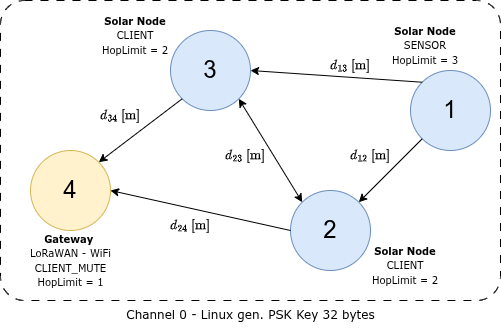

# Meshtastic TestBed Platform

> An early-stage environmental monitoring platform built on LoRa mesh networking and Meshtastic firmware, using solar-powered nodes and a gateway. Designed to host one or more physical testbeds — the first is the **San Joaquín** deployment (see [`docs/testbeds/san-joaquin.md`](docs/testbeds/san-joaquin.md)).

**Cyber-Physical Systems Research and Technology Center**
[Pontificia Universidad Católica de Chile](https://www.uc.cl)

---

## Overview

This project establishes a LoRa mesh network for environmental monitoring — capturing **temperature, humidity, power metrics, and GPS data** from remote solar-powered nodes. Configuration and control are handled through Python scripts that interface with the [Meshtastic](https://meshtastic.org/) CLI, without modifying the underlying firmware.

The network consists of **3 SensCAP Solar Node P1 Pro sensor nodes** and **1 LILYGO gateway board**, connected via USB to a host. The gateway host is currently a desktop; a move to a **Raspberry Pi with a 5G HAT** (for field placement and cellular backhaul) is under study — see [`docs/architecture/gateway-rpi-5g.md`](docs/architecture/gateway-rpi-5g.md).

The realtime dashboard is part of this repo at **`monitor/`** (Flask + SocketIO, reads from InfluxDB and listens on MQTT). It is started alongside the rest of the stack by `docker compose up -d`.

---

## Hardware

| Component | Role | Details |
|---|---|---|
| **Seeed Studio SensCAP Solar Node P1 Pro** (×3) | Sensor Nodes | Solar-powered LoRa nodes; temperature & humidity sensing |
| **LILYGO Board** (×1) | Gateway | USB-connected to host; role `CLIENT_MUTE` |
| **Gateway Host** | Control Hub | Runs Python scripts + data pipeline. Currently a desktop; Raspberry Pi + 5G HAT under study (see `docs/architecture/gateway-rpi-5g.md`) |

### Architecture Diagrams

<table><tr>
<td align="center" width="33%">
  
  <br/><em>SensCAP sensor node</em>
</td>
<td align="center" width="33%">
  
  <br/><em>LILYGO gateway</em>
</td>
<td align="center" width="33%">
  
  <br/><em>Mesh network topology</em>
</td>
</tr></table>

---

## Repository Structure

```
LoRa-TestBed-Platform/
│
├── src/
│   ├── common/
│   │   ├── radio_config.py           # Single source of truth: channel, region, preset, PSK
│   │   └── meshtastic_cli.py         # Shared run()/retry helper (used by gateway + node)
│   │
│   ├── gateway/
│   │   ├── configure.py              # Configure the LILYGO gateway via Meshtastic CLI
│   │   ├── configure_params.py       # Gateway-specific parameter constants
│   │   ├── config.py                 # Gateway runtime config
│   │   ├── receiver.py               # Main gateway receiver (requires --port)
│   │   ├── mesh_receiver.py          # Mesh packet receiver / decoder
│   │   └── mqtt_connector.py         # Publishes decoded telemetry to Mosquitto
│   │
│   ├── node/
│   │   ├── configure.py              # Configure a sensor node via Meshtastic CLI
│   │   └── configure_params.py       # Node-specific parameter constants
│   │
│   └── tools/
│       ├── check_node_info.py        # Reads and prints node info over serial
│       └── plot_history.py           # Plots telemetry history from InfluxDB
│
├── firmware/
│   ├── erase_firmware/               # UF2 binary to erase existing firmware (nRF52)
│   └── upload_firmware/              # Meshtastic UF2 firmware binary for SensCAP nodes
│
├── docs/                             # Documentation, diagrams, and reference files
│   └── read_config.txt               # Reference: reading device config via CLI
│
├── mqtt/
│   └── mosquitto.conf                # Mosquitto broker configuration
│
├── monitor/                          # Realtime web dashboard (Flask + SocketIO)
│   ├── app.py                        # Flask application entry point
│   ├── utils.py                      # InfluxDB query helpers
│   ├── param.py                      # Dashboard configuration constants
│   ├── Dockerfile                    # Container image for the web service
│   ├── requirements.txt              # Python dependencies for the web service
│   ├── templates/
│   │   ├── base.html                 # Shared layout
│   │   ├── map.html                  # Leaflet map view (/map)
│   │   └── dashboard.html            # Live charts view (/dashboard?node=<id>)
│   └── static/                       # CSS, JS, and asset files
│
├── telegraf/
│   └── etc/telegraf.conf             # Telegraf agent configuration (MQTT → InfluxDB)
│
├── docker-compose.yaml               # Container orchestration (mosquitto + influxdb + telegraf + web)
├── configuration.env                 # InfluxDB + web credentials (gitignored; see .example)
├── configuration.env.example         # Template for configuration.env
├── .env                              # Channel PSK and secrets (gitignored; see .example)
├── .env.example                      # Template for .env
├── mesh_config.json                  # Per-node mesh parameters (roles, hop limits, IDs)
└── requirements.txt                  # Python dependencies
```

---

## Configuration & Secrets

Sensitive values are kept out of version control in two gitignored env files:

- **`.env`** — channel PSK and any other radio secrets. Copy from `.env.example` and fill in.
- **`configuration.env`** — InfluxDB credentials used by Docker Compose / Telegraf. Copy from `configuration.env.example` and fill in.

`src/common/radio_config.py` reads the PSK from `.env` at import time and is the single source of truth for channel name, region, modem preset, and PSK — imported by both `src/gateway/configure.py` and `src/node/configure.py`.

---

## Key Files

### `src/common/radio_config.py` — Shared Radio Configuration

Single source of truth for all LoRa radio parameters shared between gateway and node scripts:

- **Channel settings** — channel index, name (`TB CPS-RTC`), and PSK (loaded from `.env`)
- **LoRa radio settings** — region (`ANZ`) and modem preset (`LONG_FAST`)

### `src/node/configure_params.py` — Sensor Node Parameters

Centralises all configurable constants for the sensor node configuration script:

- **Rebroadcast mode** — set to `LOCAL_ONLY` to isolate the mesh from foreign traffic
- **Telemetry intervals** — device & environment measurements every `60` seconds; GPS position update every `300` seconds, GPS broadcast every `600` seconds
- **Device roles** — `CLIENT` or `SENSOR`
- **Hop limit** — computed as `REQUIRED_HOPS_TO_GATEWAY + 1`; must be set per node

### `src/node/configure.py` — Sensor Node Configuration Script

Configures a single sensor node via the Meshtastic CLI. Run once per node. Applies settings in this order: LoRa region → hop limit → rebroadcast mode → channel → device role → telemetry intervals → GPS interval → reboot.

```bash
python src/node/configure.py --node-id 1 [--port /dev/ttyUSB0]
```

### `src/gateway/configure.py` — Gateway Configuration Script

Configures the LILYGO gateway with role `CLIENT_MUTE` (receives mesh traffic but does not rebroadcast), and disables telemetry and GPS since it only acts as a data sink.

```bash
python src/gateway/configure.py [--port /dev/ttyUSB0]
```

### `src/gateway/receiver.py` — Gateway Receiver

Listens for mesh telemetry over serial and publishes to Mosquitto. The `--port` flag is **required** (auto-detection was removed).

```bash
python src/gateway/receiver.py --port /dev/ttyACM0
```

### `src/tools/check_node_info.py` — Node Inspection Utility

Connects to a node over serial and prints its current info. Useful for verifying connectivity and reading hardware IDs.

```bash
python src/tools/check_node_info.py
```

### `src/tools/plot_history.py` — Telemetry History Plot

Queries InfluxDB and plots historical telemetry data.

```bash
python src/tools/plot_history.py
```

### `mesh_config.json` — Per-Node Mesh Parameters

Defines each node's hardware ID, `device_role`, and `hop_limit`. Referenced at runtime by `src/node/configure.py`.

```json
{
  "nodes_cfg": {
    "1": {"id": "!0b64122b", "hop_limit": 3, "device_role": "CLIENT"},
    "2": {"id": "!6c73ff1c", "hop_limit": 3, "device_role": "CLIENT"},
    "3": {"id": "!9d84gg2d", "hop_limit": 2, "device_role": "CLIENT"}
  }
}
```

| Field | Description |
|---|---|
| `id` | Hardware ID from the device label or `src/tools/check_node_info.py`. Format: `!xxxxxxxx` |
| `hop_limit` | Hops to gateway + 1. Adjacent nodes use `2`; farther nodes use `3` |
| `device_role` | `SENSOR` for nodes with active telemetry; `CLIENT` for relay or secondary nodes |

---

## Getting Started

### Prerequisites

- Python 3.8+
- Docker and Docker Compose
- LILYGO gateway and sensor nodes (connected one at a time via USB during configuration)
- Meshtastic Python CLI (installed via `requirements.txt`)

### Installation

```bash
git clone https://github.com/OF306PUC/LoRa-TestBed-Platform.git
cd LoRa-TestBed-Platform

python3 -m venv .venv
source .venv/bin/activate
pip install -r requirements.txt

# Set up secrets
cp .env.example .env                           # then fill in PSK
cp configuration.env.example configuration.env # then fill in InfluxDB creds
```

---

### Step 1 — Flash Meshtastic Firmware

> **Required before any Python configuration.** The Meshtastic CLI communicates over USB serial and will not work on a device without Meshtastic firmware.

The `firmware/` folder contains firmware binaries for the SensCAP Solar Node P1 Pro (nRF52). Flashing is done via drag-and-drop — no additional tools needed.

#### 1a — Erase existing firmware *(recommended for new or re-used devices)*

1. Connect the device via USB.
2. Double-press the reset button to enter bootloader mode — the device appears as a USB drive.
3. Drag and drop `firmware/erase_firmware/nrf_erase_sd7_3.uf2` onto the drive.
4. The device reboots; the drive reappears — it is now erased.

#### 1b — Flash Meshtastic firmware

1. Double-press reset to re-enter bootloader mode.
2. Drag and drop `firmware/upload_firmware/firmware-seeed_solar_node-2.7.19.bb3d6d5.uf2` onto the drive.
3. The device reboots automatically once complete.
4. Repeat Steps 1a–1b for all 3 sensor nodes.

> The LILYGO gateway uses a different flashing method — see the [Meshtastic flashing docs](https://meshtastic.org/docs/getting-started/flashing-firmware/) for ESP32 boards.

Full nRF52 reference: [Meshtastic UF2 Drag-and-Drop Flashing Guide](https://meshtastic.org/docs/getting-started/flashing-firmware/nrf52/drag-n-drop/)

---

### Step 2 — Configure the Gateway

```bash
python src/gateway/configure.py [--port /dev/ttyUSB0]
```

Applies `CLIENT_MUTE` role, channel settings, and disables telemetry/GPS. Reboots automatically.

---

### Step 3 — Configure Each Sensor Node

1. Connect a sensor node via USB.
2. Review `src/common/radio_config.py` and `src/node/configure_params.py`; update if needed.
3. Verify the node's `hop_limit` and `device_role` in `mesh_config.json`.
4. Run:

```bash
python src/node/configure.py --node-id 1 [--port /dev/ttyUSB0]   # repeat for IDs 2, 3
```

The node reboots automatically once all settings are applied.

---

## Deployment

These steps bring up the full data pipeline. They are independent of the hardware configuration above and assume the mesh network is already set up.

### Stage 1 — Register a New Node

Use `src/tools/check_node_info.py` to find the node's hardware ID, then add it to `mesh_config.json` under `nodes_cfg` before running any configuration scripts.

### Stage 2 — Start the Infrastructure Containers

The pipeline runs on four Docker services: **Mosquitto** (MQTT broker), **InfluxDB** (time-series DB), **Telegraf** (MQTT → InfluxDB bridge), and **web** (Flask + SocketIO dashboard).

```bash
docker compose up -d
docker compose ps
```

Expected output:

```
NAME                       IMAGE                          STATUS
telegraf                   telegraf:1.32-alpine           Up
influxdb                   influxdb:1.11-alpine           Up
lora-testbed-mqtt-broker   eclipse-mosquitto:2.0          Up
lora-testbed-web           lora-testbed-platform-web      Up
```

Useful commands:

```bash
docker compose logs -f <service>   # telegraf | influxdb | mosquitto | web
docker compose down
```

> InfluxDB data is persisted in the `influxdb_data` Docker volume and survives restarts.

### Stage 3 — Run the Gateway Receiver

The receiver reads mesh telemetry over serial and publishes it to Mosquitto under
`lora-testbed/<node-label>/{device,environment,position}`. Telegraf writes these to
InfluxDB automatically. Choose **one** of the two ways to run it below — do not run both
at once, since they would both try to open the same serial port.

#### Option A — Manual (for testing and debugging)

Runs in the foreground and logs to the terminal; stop with `Ctrl+C`.

```bash
source .venv/bin/activate
python src/gateway/receiver.py --port /dev/ttyACM0
```

#### Option B — As a systemd service (recommended for permanent deployment)

For unattended operation, install the receiver as a systemd service so it starts on boot
and restarts automatically on failure. Run from the repo root:

```bash
sudo ./install_service.sh --port /dev/ttyACM0    # --port defaults to /dev/ttyACM0
```

This writes `/etc/systemd/system/lora-gateway.service` (wired to the repo's `.venv` and
`src/gateway/receiver.py`), then enables and starts it. Manage it with:

```bash
sudo systemctl status  lora-gateway    # check status
journalctl -u lora-gateway -f          # follow live logs
sudo systemctl restart lora-gateway    # restart
sudo systemctl stop    lora-gateway    # stop
sudo systemctl disable lora-gateway    # don't start on boot
```

> **Prerequisite:** the virtualenv must already exist (`python3 -m venv .venv && pip install -r requirements.txt`) — the installer checks for `.venv/bin/python` and aborts if it's missing. The service runs as the invoking user (`$SUDO_USER`) and starts after `network.target` and `docker.service`.

To verify data is flowing, open the InfluxDB CLI inside the container:

```bash
docker exec -it influxdb influx
```

Then run these queries inside the shell:

```sql
-- List available databases
SHOW DATABASES

-- Select the testbed database
USE cpsrtc_lora_telemetry

-- Confirm the measurement exists
SHOW MEASUREMENTS

-- Count total points written
SELECT count("received_at") FROM mqtt_consumer

-- Inspect the last 5 rows (most recent first)
SELECT * FROM mqtt_consumer ORDER BY time DESC LIMIT 5

-- Filter by a specific node
SELECT * FROM mqtt_consumer WHERE node_id='!7c70da02' ORDER BY time DESC LIMIT 5
```

Exit the shell with `exit` or `Ctrl+D`.

---

## Web Monitor

The realtime dashboard lives at `monitor/` and is a Flask + Flask-SocketIO application. It is included in the root `docker-compose.yaml` as the `web` service (container `lora-testbed-web`) and starts automatically with `docker compose up -d`.

Once the stack is running, open **http://localhost:5000** in a browser:

| Route | Description |
|---|---|
| `/` | Redirects to `/map` |
| `/map` | Leaflet map showing all nodes (data from `/api/nodes`) |
| `/dashboard?node=<id>` | Live charts for a single node — temperature, humidity, power (data from `/api/recent/<id>/<field>` + Socket.IO `mqtt_message` events) |

The `web` service connects to `influxdb` and `mosquitto` by Docker service name on the shared `telegraf_network` — no host networking required. DB credentials are read from `configuration.env` (`DB_USERNAME`, `DB_PASSWORD`); non-secret config (bucket, host, port) is set in the `environment:` block of `docker-compose.yaml`.

---

## Sensors & Data

| Measurement | Status |
|---|---|
| Temperature | Active |
| Humidity | Active |
| Power / Battery (`voltage`, `batteryLevel`) | Active |
| GPS coordinates | Active |
| USB power & charging state (`usbPower`, `isCharging`) | Under debug |

### Timestamps

All measurements are timestamped at **gateway reception time** and, when GPS is enabled, at sensing time.

---

## Current Status

Early / Experimental

- [x] LoRa mesh network established between 3 nodes and gateway
- [x] Python-based node and gateway configuration via Meshtastic CLI
- [x] Temperature & humidity telemetry
- [x] Per-node hop limit and device role configuration
- [x] Gateway configured as `CLIENT_MUTE` (receive-only)
- [x] MQTT broker, InfluxDB, and Telegraf containerised
- [x] GPS data collection
- [x] Codebase reorganised into `src/` package with shared `common/` layer
- [x] Channel PSK and InfluxDB credentials moved to gitignored env files

---

## Roadmap

**Phase 1 — Application-Layer Configuration** *(current)*
Configure nodes and collect telemetry via Meshtastic CLI and Python, without modifying firmware.

**Phase 2 — Firmware Customization** *(planned)*
Modify Meshtastic firmware to add custom sensor integrations (through I2C hub), tune telemetry intervals for low-power solar operation, and fix `usbPower`/`isCharging` reporting.

**Phase 3 — Build From Source** *(planned)*
Set up a full PlatformIO environment to compile and flash custom firmware onto SensCAP nodes and the LILYGO gateway.

---

## Troubleshooting

### I2C Sensor Detected but No Telemetry Posted (SHT4X)

**Symptom:** Node detects SHT4X at address `0x44` but no temperature or humidity appears in MQTT or InfluxDB.

#### Physical Setup

<table><tr>
<td align="center" width="30%">
  
  <br/><em>Grove port on the node board. Note the cable twist at the connector.</em>
</td>
<td align="center" width="30%">
  
  <br/><em>Grove I2C Hub inside the enclosure.</em>
</td>
</tr></table>

#### Root Cause

The I2C bus scan and driver init are separate steps. The scan only checks for an ACK at `0x44`; driver init then attempts to read the SHT4X serial number via `readSerial()`. If that read fails, the sensor is dropped from `nodeTelemetrySensorsMap` permanently (no retry at runtime). A cable twist at the Grove connector causes marginal contact that passes the short ACK but fails the multi-byte serial read. The Grove I2C Hub adds capacitance that can further degrade signal integrity.

**`SHT4X found at address 0x44` is not a reliable indicator that telemetry will flow.**

#### Identifying Failure vs. Success in the Serial Monitor

| | Failure | Success |
|---|---|---|
| After `Init sensor: SHT4X` | `Error trying to execute readSerial()` | `serialNumber : 11d75c14` |
| Result | `Can't connect to detected SHT4X sensor` | `Opened SHT4X sensor on i2c bus` |

#### Workarounds

1. **Relieve the cable twist** — ensure the Grove cable sits flat and unstressed at the connector.
2. **Reseat all Grove connectors** at both the node board and the I2C Hub, then power-cycle.
3. **Connect the SHT4X directly** to the Grove port (no hub) to rule out hub-induced capacitance.
4. **Inspect the serial boot log** for `serialNumber :` (success) vs `Error trying to execute readSerial()` (failure).

> Log lines `Could not open / read /prefs/uiconfig.proto` and `Could not open / read /prefs/cannedConf.proto` are normal and unrelated.

**Planned fix:** Full I2C Grove hub support with retry logic is scoped for Phase 2 — Firmware Customization.

---

## References

- [Meshtastic Documentation](https://meshtastic.org/docs/)
- [Meshtastic Python API](https://python.meshtastic.org/)
- [Meshtastic UF2 Flashing Guide](https://meshtastic.org/docs/getting-started/flashing-firmware/nrf52/drag-n-drop/)
- [Seeed Studio SensCAP Solar Node P1 Pro](https://www.seeedstudio.com/)
- [LILYGO LoRa Boards](https://www.lilygo.cc/)

---

## License

This project is currently unlicensed. License to be determined.

---

*Developed at the Cyber-Physical Systems Research and Technology Center, Pontificia Universidad Católica de Chile.*
