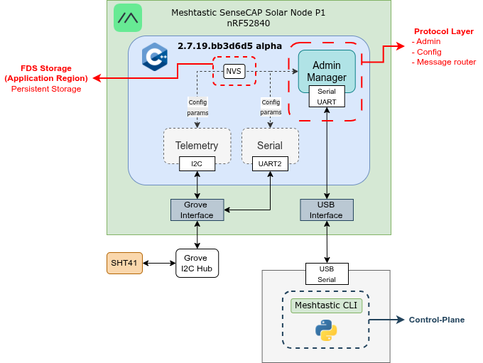
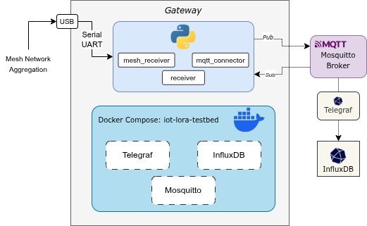
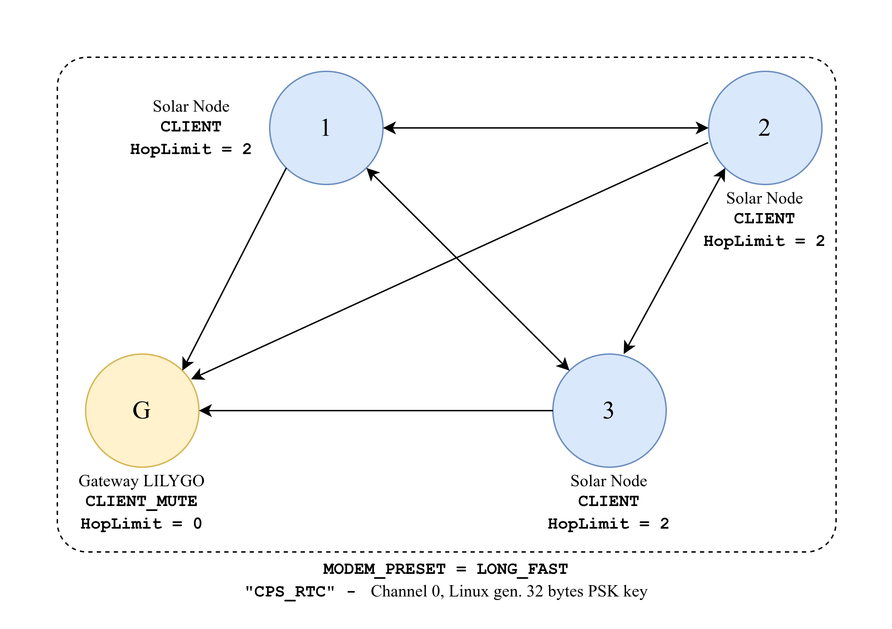
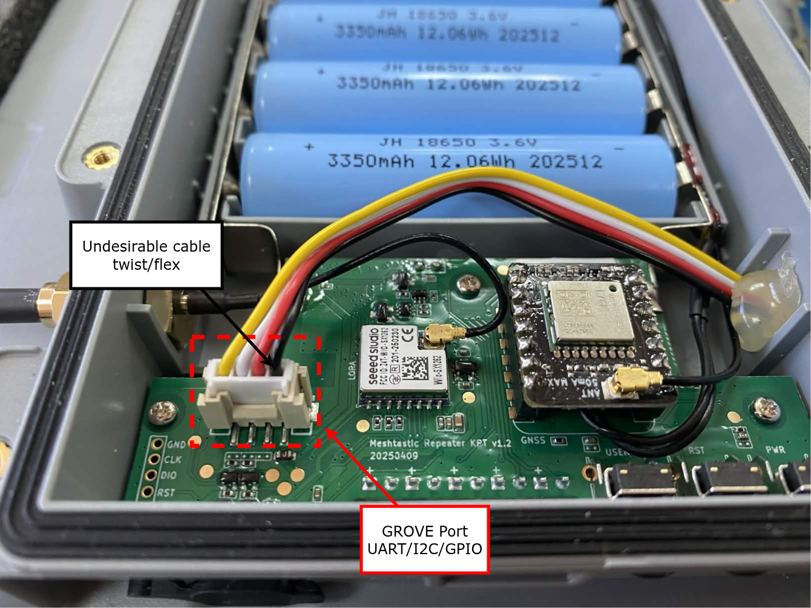
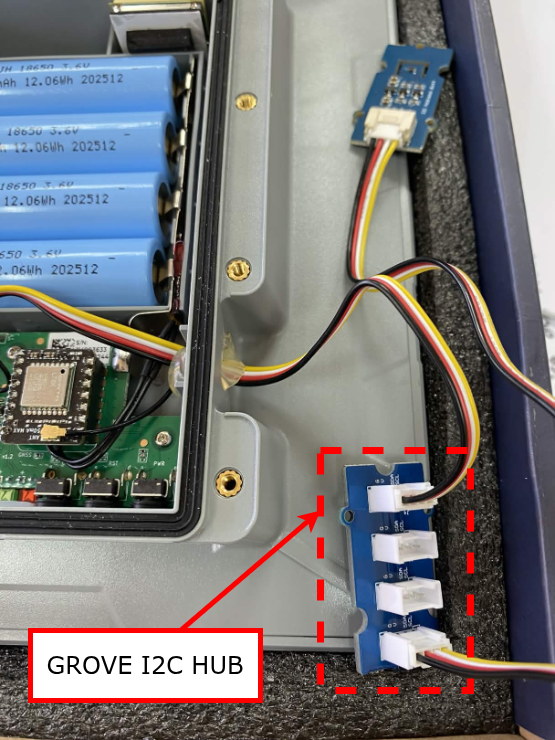

# Meshtastic TestBed Platform

> An early-stage environmental monitoring platform built on LoRa mesh networking and Meshtastic firmware, using solar-powered nodes and a gateway. Designed to host one or more physical testbeds — the first is the **San Joaquín** deployment (see [`docs/testbeds/san-joaquin.md`](docs/testbeds/san-joaquin.md)).

**Cyber-Physical Systems Research and Technology Center**
[Pontificia Universidad Católica de Chile](https://www.uc.cl)

---

## Overview

This project establishes a LoRa mesh network for environmental monitoring — capturing **temperature, humidity, power metrics, and GPS data** from remote solar-powered nodes. Configuration and control are handled through Python scripts that interface with the [Meshtastic](https://meshtastic.org/) CLI, without modifying the underlying firmware.

The network consists of **3 SensCAP Solar Node P1 Pro sensor nodes** and **1 LILYGO gateway board**, connected via USB to a host. The gateway host is currently a desktop; a move to a **Raspberry Pi with a 5G HAT** (for field placement and cellular backhaul) is under study — see [`docs/architecture/gateway-rpi-5g.md`](docs/architecture/gateway-rpi-5g.md).

The realtime dashboard is part of this repo at **`monitor/`** (Flask + SocketIO, reads from InfluxDB and listens on MQTT). It is started alongside the rest of the stack by `docker compose up -d`.

---

## Hardware

| Component | Role | Details |
|---|---|---|
| **Seeed Studio SensCAP Solar Node P1 Pro** (×3) | Sensor Nodes | Solar-powered LoRa nodes; temperature & humidity sensing |
| **LILYGO Board** (×1) | Gateway | USB-connected to host; role `CLIENT_MUTE` |
| **Gateway Host** | Control Hub | Runs Python scripts + data pipeline. Currently a desktop; Raspberry Pi + 5G HAT under study (see `docs/architecture/gateway-rpi-5g.md`) |

### Architecture Diagrams

<table><tr>
<td align="center" width="33%">
  
  <br/><em>SensCAP sensor node</em>
</td>
<td align="center" width="33%">
  
  <br/><em>LILYGO gateway</em>
</td>
<td align="center" width="33%">
  
  <br/><em>Mesh network topology</em>
</td>
</tr></table>

---

## Repository Structure

```
meshtastic-testbed-platform/
│
├── src/
│   ├── common/
│   │   ├── radio_config.py           # Single source of truth: channel, region, preset, PSK
│   │   └── meshtastic_cli.py         # Shared run()/retry helper (used by gateway + node)
│   │
│   ├── gateway/
│   │   ├── configure.py              # Configure the LILYGO gateway via Meshtastic CLI
│   │   ├── configure_params.py       # Gateway-specific parameter constants
│   │   ├── config.py                 # Gateway runtime config (env-overridable)
│   │   ├── receiver.py               # Main gateway receiver (--port or GATEWAY_SERIAL_PORT)
│   │   ├── mesh_receiver.py          # Mesh packet receiver / decoder
│   │   ├── mqtt_connector.py         # Publishes decoded telemetry to Mosquitto
│   │   ├── Dockerfile                # Slim image for the gateway-receiver service
│   │   └── requirements.txt          # Gateway-only Python dependencies
│   │
│   ├── node/
│   │   ├── configure.py              # Configure a sensor node via Meshtastic CLI
│   │   └── configure_params.py       # Node-specific parameter constants
│   │
│   └── tools/
│       ├── check_node_info.py        # Reads and prints node info over serial
│       ├── plot_history.py           # Plots telemetry history from InfluxDB
│       └── field_testing/            # Offline node-install validation (CSV + plots)
│           ├── configure_device.py   # Configure the portable test gateway (reuses common/)
│           ├── receiver.py           # Serial → per-node CSV receiver (+ gateway GPS)
│           ├── mesh_receiver.py      # CSV-logging receiver class
│           ├── plot_data.py          # Session plots from CSV (RSSI/SNR, trajectory)
│           ├── example_config.yaml.example  # Sanitised reference device export
│           └── README.md             # BLE-app vs test-receiver validation guide
│
├── firmware/
│   ├── erase_firmware/               # UF2 binary to erase existing firmware (nRF52)
│   └── upload_firmware/              # Meshtastic UF2 firmware binary for SensCAP nodes
│
├── docs/                             # Documentation, diagrams, and reference files
│   └── read_config.txt               # Reference: reading device config via CLI
│
├── mqtt/
│   └── mosquitto.conf                # Mosquitto broker configuration
│
├── monitor/                          # Realtime web dashboard (Flask + SocketIO)
│   ├── app.py                        # Flask application entry point
│   ├── utils.py                      # InfluxDB query helpers
│   ├── param.py                      # Dashboard configuration constants
│   ├── Dockerfile                    # Container image for the web service
│   ├── requirements.txt              # Python dependencies for the web service
│   ├── templates/
│   │   ├── base.html                 # Shared layout
│   │   ├── map.html                  # Leaflet map view (/map)
│   │   └── dashboard.html            # Live charts view (/dashboard?node=<id>)
│   └── static/                       # CSS, JS, and asset files
│
├── telegraf/
│   └── etc/telegraf.conf             # Telegraf agent configuration (MQTT → InfluxDB)
│
├── docker-compose.yaml               # Container orchestration (mosquitto + influxdb + telegraf + gateway-receiver + web)
├── configuration.env                 # InfluxDB + web credentials (gitignored; see .example)
├── configuration.env.example         # Template for configuration.env
├── .env                              # Channel PSK and secrets (gitignored; see .example)
├── .env.example                      # Template for .env
├── mesh_config.json                  # Per-node mesh parameters (roles, hop limits, IDs)
├── requirements.txt                  # Provisioning + inspection deps (host)
└── requirements-analysis.txt         # Plotting deps (matplotlib/pandas), optional
```

---

## Configuration & Secrets

Sensitive values are kept out of version control in three gitignored files:

- **`.env`** — channel PSK and any other radio secrets. Copy from `.env.example` and fill in.
- **`configuration.env`** — InfluxDB and MQTT credentials used by Docker Compose, Telegraf, the gateway receiver and the dashboard. Copy from `configuration.env.example` and fill in.
- **`mqtt/pwfile`** — the broker's hashed passwords. Generated by `./mqtt/init-credentials.sh`, never edited by hand, and only valid alongside the matching plaintext in `configuration.env`.

`mqtt/aclfile` sits next to the password file but is **not** secret: it is topic
permissions, tracked in git, and readable on purpose.

`src/common/radio_config.py` reads the PSK from `.env` at import time and is the single source of truth for channel name, region, modem preset, and PSK — imported by both `src/gateway/configure.py` and `src/node/configure.py`.

---

## Key Files

### `src/common/radio_config.py` — Shared Radio Configuration

Single source of truth for all LoRa radio parameters shared between gateway and node scripts:

- **Channel settings** — channel index, name (`CPS_RTC`), and PSK (loaded from `.env`)
- **LoRa radio settings** — region (`ANZ`) and modem preset (`LONG_FAST`)

### `src/node/configure_params.py` — Sensor Node Parameters

Centralises all configurable constants for the sensor node configuration script:

- **Rebroadcast mode** — set to `LOCAL_ONLY` to isolate the mesh from foreign traffic
- **Telemetry intervals** — device & environment measurements every `60` seconds; GPS position update every `300` seconds, GPS broadcast every `600` seconds
- **Device roles** — `CLIENT` or `SENSOR`
- **Hop limit** — computed as `REQUIRED_HOPS_TO_GATEWAY + 1`; must be set per node

### `src/node/configure.py` — Sensor Node Configuration Script

Configures a single sensor node via the Meshtastic CLI. Run once per node. Applies settings in this order: LoRa region → hop limit → rebroadcast mode → channel → device role → telemetry intervals → GPS interval → reboot.

```bash
python src/node/configure.py --node-id 1 [--port /dev/ttyUSB0]
```

### `src/gateway/configure.py` — Gateway Configuration Script

Configures the LILYGO gateway with role `CLIENT_MUTE` (receives mesh traffic but does not rebroadcast), and disables telemetry and GPS since it only acts as a data sink.

```bash
python src/gateway/configure.py [--port /dev/ttyUSB0]
```

### `src/gateway/receiver.py` — Gateway Receiver

Listens for mesh telemetry over serial and publishes to Mosquitto. The `--port` flag is **required** (auto-detection was removed).

```bash
python src/gateway/receiver.py --port /dev/ttyACM0
```

### `src/tools/check_node_info.py` — Node & Mesh Inspector

Connects over serial (auto-detects the port) and, in one pass: prints the local node's info + telemetry, health-checks its radio settings/PSKs against `common/radio_config.py`, and dumps the heard mesh cross-checked against `mesh_config.json`. Exits non-zero on any drift/mismatch.

```bash
python src/tools/check_node_info.py                 # auto-detect port
python src/tools/check_node_info.py --port /dev/ttyACM0
python src/tools/check_node_info.py --no-mesh       # skip mesh dump
```

### `src/tools/plot_history.py` — Telemetry History Plot

Queries InfluxDB and plots historical telemetry data.

```bash
python src/tools/plot_history.py
```

### `src/tools/field_testing/` — Field-Install Validation Toolkit

Offline tools to validate solar nodes **while installing them in the field** —
separate from the production MQTT/InfluxDB pipeline (logs to CSV, no Docker).
Two methods: a quick **BLE** check via the Meshtastic app, or a **portable test
receiver** that logs telemetry/position (with RSSI/SNR) plus the gateway's own
GPS track, then plots the session. Full guide in
[`src/tools/field_testing/README.md`](src/tools/field_testing/README.md).

```bash
python src/tools/field_testing/configure_device.py --port /dev/ttyACM0  # set up the portable gateway (once)
python src/tools/field_testing/receiver.py --port /dev/ttyACM0          # log a session to field-testing-data/
python src/tools/field_testing/plot_data.py                             # analyse the session
```

### `mesh_config.json` — Per-Node Mesh Parameters

Defines each node's hardware ID, `device_role`, and `hop_limit`. Referenced at runtime by `src/node/configure.py`.

```json
{
  "nodes_cfg": {
    "1": {"id": "!0b64122b", "hop_limit": 2, "device_role": "CLIENT"},
    "2": {"id": "!6c73ff1c", "hop_limit": 2, "device_role": "CLIENT"},
    "3": {"id": "!9d84gg2d", "hop_limit": 2, "device_role": "CLIENT"}
  }
}
```

| Field | Description |
|---|---|
| `id` | Hardware ID from the device label or `src/tools/check_node_info.py`. Format: `!xxxxxxxx` |
| `hop_limit` | Hops to gateway + 1. Adjacent nodes use `2`; farther nodes use `3` |
| `device_role` | `SENSOR` for nodes with active telemetry; `CLIENT` for relay or secondary nodes |

---

## Getting Started

### Prerequisites

- **Docker and Docker Compose** — run the entire platform.
- A **Linux host** with the LILYGO gateway connected via USB (its serial device is passed through to a container).
- **Python 3.8+** — only for the one-time hardware-configuration scripts below; not needed to run the stack.

### Installation

```bash
git clone https://github.com/OF306PUC/meshtastic-testbed-platform.git
cd meshtastic-testbed-platform

# Create the config files from their templates, then fill them in
cp .env.example .env                           # channel PSK + gateway serial port
cp configuration.env.example configuration.env # InfluxDB + MQTT credentials
```

**Then generate the broker credentials.** The MQTT broker does not accept
anonymous clients, so this step is mandatory — skip it and every service is
refused while the containers stay up and the dashboard renders, which looks like
nothing being wrong at all.

```bash
./mqtt/init-credentials.sh     # creates mqtt/pwfile, prints the MQTT_* block
```

Paste the printed block into `configuration.env`, replacing the `change_me`
placeholders. Neither `configuration.env` nor `mqtt/pwfile` is in git, and they
must be generated **together** on each host: copying one and regenerating the
other leaves the hashes out of step with the passwords.

Five accounts are created, one per role, with per-topic rules in `mqtt/aclfile`.
The PBX collectors `p1`/`p2` may write only their own subtree, so neither can
forge the other's measurements.

The runtime stack runs entirely in Docker — no Python install is needed to run it, and nothing below has to be installed on the gateway Pi or a collector Pi. A local virtualenv is only required for the **hardware-configuration and analysis scripts**, and those are two separate dependency sets:

```bash
python3 -m venv .venv
source .venv/bin/activate

# Provisioning + inspection: configure.py, check_node_info.py
pip install -r requirements.txt

# Only if you also plot: plot_history.py, field_testing/plot_data.py
pip install -r requirements-analysis.txt
```

The split is deliberate. `requirements-analysis.txt` pulls matplotlib, pandas and
numpy, which compile from source wherever a platform has no prebuilt wheel — so
provisioning a radio no longer drags a numeric stack along, and a machine that
only plots does not need `meshtastic` at all.

> If a fresh install fails on a Raspberry Pi with TLS or certificate errors,
> check the clock before the packages: `timedatectl`. A Pi has no battery-backed
> RTC and restores a stale time at boot, which makes valid certificates look
> not-yet-valid and breaks `pip` and `apt` alike.

---

## Hardware Setup (one-time, per device)

Flash firmware and apply radio/mesh configuration to each device over USB, using the local virtualenv from the Installation step. This is done once per device; afterwards the platform runs entirely in Docker.

### Step 1 — Flash Meshtastic Firmware

> **Required before any configuration.** The Meshtastic CLI communicates over USB serial and will not work on a device without Meshtastic firmware.

The `firmware/` folder contains firmware binaries for the SensCAP Solar Node P1 Pro (nRF52). Flashing is done via drag-and-drop — no additional tools needed.

#### 1a — Erase existing firmware *(recommended for new or re-used devices)*

1. Connect the device via USB.
2. Double-press the reset button to enter bootloader mode — the device appears as a USB drive.
3. Drag and drop `firmware/erase_firmware/nrf_erase_sd7_3.uf2` onto the drive.
4. The device reboots; the drive reappears — it is now erased.

#### 1b — Flash Meshtastic firmware

1. Double-press reset to re-enter bootloader mode.
2. Drag and drop `firmware/upload_firmware/firmware-seeed_solar_node-2.7.19.bb3d6d5.uf2` onto the drive.
3. The device reboots automatically once complete.
4. Repeat Steps 1a–1b for all 3 sensor nodes.

> The LILYGO gateway uses a different flashing method — see the [Meshtastic flashing docs](https://meshtastic.org/docs/getting-started/flashing-firmware/) for ESP32 boards.

Full nRF52 reference: [Meshtastic UF2 Drag-and-Drop Flashing Guide](https://meshtastic.org/docs/getting-started/flashing-firmware/nrf52/drag-n-drop/)

---

### Step 2 — Configure the Gateway

```bash
python src/gateway/configure.py [--port /dev/ttyUSB0]
```

Applies `CLIENT_MUTE` role, channel settings, and disables telemetry/GPS. Reboots automatically.

---

### Step 3 — Register & Configure Each Sensor Node

1. Connect a sensor node via USB.
2. Find its hardware ID with `python src/tools/check_node_info.py`, then add it to `mesh_config.json` under `nodes_cfg` with its `hop_limit` and `device_role`.
3. Review `src/common/radio_config.py` and `src/node/configure_params.py`; update if needed.
4. Apply the configuration:

```bash
python src/node/configure.py --node-id 1 [--port /dev/ttyUSB0]   # repeat for IDs 2, 3
```

The node reboots automatically once all settings are applied.

---

## Running the Platform

The entire runtime runs as Docker services. With the LILYGO gateway connected to the host via USB, one command brings everything up:

```bash
docker compose up -d --build
docker compose ps
```

> **Use `--build`.** `gateway-receiver` and `web` bake their Python into the image
> with `COPY`, and plain `docker compose up -d` will **not** rebuild after a
> `git pull` or a local edit — it silently restarts the old code. Telegraf is
> immune because it mounts its config as a volume.

Expected output:

```
NAME                             IMAGE                                          STATUS
meshtastic-testbed-mqtt-broker   eclipse-mosquitto:2.0                          Up
influxdb                         influxdb:1.11-alpine                           Up
telegraf                         telegraf:1.32-alpine                           Up
meshtastic-testbed-gateway       meshtastic-testbed-platform-gateway-receiver   Up
meshtastic-testbed-web           meshtastic-testbed-platform-web                Up
```

| Service | Role |
|---|---|
| `mosquitto` | MQTT broker |
| `influxdb` | Time-series database (persisted in the `influxdb_data` volume, survives restarts) |
| `telegraf` | Bridges MQTT → InfluxDB |
| `gateway-receiver` | Reads mesh telemetry from the USB gateway and publishes it to MQTT |
| `web` | Realtime dashboard — [http://localhost:5000](http://localhost:5000) |

Useful commands:

```bash
docker compose logs -f gateway-receiver   # or: mosquitto | influxdb | telegraf | web
docker compose restart gateway-receiver
docker compose down
```

> The gateway board must be plugged in **before** `docker compose up`. `restart: unless-stopped` brings the receiver back automatically after a crash or host reboot.

**Point `GATEWAY_SERIAL_PORT` at a `by-id` path, not at `ttyACM0`.** The `ttyACM*`
numbering is assignment order, not identity: it changes between reboots and
depends on what else is plugged in. On this testbed `ttyACM0` has been a SensCAP
node while the gateway sat on `ttyACM1`. With the wrong path the container starts
cleanly and hears nothing.

```bash
ls -l /dev/serial/by-id/          # pick the LILYGO / CH34x entry
GATEWAY_SERIAL_PORT=/dev/serial/by-id/usb-... docker compose up -d --build
```

The host user also needs to be in the `dialout` group to open the device
(`sudo usermod -aG dialout "$USER"`, then log out and back in).

### Verify data is flowing

Open the InfluxDB CLI inside its container and inspect the latest points:

```bash
docker exec -it influxdb influx
```

```sql
USE cpsrtc_meshtastic_telemetry
SHOW MEASUREMENTS
SELECT * FROM telemetry ORDER BY time DESC LIMIT 5
SELECT * FROM telemetry WHERE node_id='!7c70da02' ORDER BY time DESC LIMIT 5
```

`SHOW MEASUREMENTS` must list **three**:

| Measurement | Fed by | Holds |
|---|---|---|
| `telemetry` | `position`, `device`, `environment` | Telemetry + the PDR fields that ride inside it |
| `pbx_message` | `message` | PBX frame metadata: `portnum`, `channel`, `src_id`, `dst_id`, `pkt_id`, link quality |
| `pdr` | `pdr` | Losses inferred while a flow was silent — the only way a fully dead node becomes visible |

If `pbx_message` or `pdr` is missing, Telegraf is not consuming those topics.
They are published at QoS 1 regardless, so a subscriber sees them even when the
database does not — check the broker before concluding the gateway is at fault:

```bash
docker exec meshtastic-testbed-mqtt-broker mosquitto_sub \
  -t 'meshtastic-testbed/#' -v -u monitor -P "$MQTT_PASSWORD_MONITOR"
```

Exit with `exit` or `Ctrl+D`.

### When nothing arrives and nothing errors

The failure mode worth recognising: containers `Up`, dashboard rendering, zero
data. Almost always a credential problem, and it is quiet by design.

```bash
docker logs telegraf | grep -i connect              # expect three "Connected"
docker logs meshtastic-testbed-web | grep '\[MQTT\]' # expect "connected", not rc=5
docker logs meshtastic-testbed-mqtt-broker | grep -i "not authoris"
```

`rc=5` or `not authorised` means the password in `configuration.env` does not
match the hash in `mqtt/pwfile`. Either regenerate both, or — if the code was
just updated — rebuild: an image carrying the pre-credential code connects
anonymously and is refused.

---

## Web Monitor

The realtime dashboard lives at `monitor/` and is a Flask + Flask-SocketIO application. It is included in the root `docker-compose.yaml` as the `web` service (container `meshtastic-testbed-web`) and starts automatically with `docker compose up -d`.

Once the stack is running, open **http://localhost:5000** in a browser:

| Route | Description |
|---|---|
| `/` | Redirects to `/map` |
| `/map` | Leaflet map showing all nodes (data from `/api/nodes`) |
| `/dashboard?node=<id>` | Live charts for a single node — temperature, humidity, power (data from `/api/recent/<id>/<field>` + Socket.IO `mqtt_message` events) |

The `web` service connects to `influxdb` and `mosquitto` by Docker service name on the shared `telegraf_network` — no host networking required. DB credentials are read from `configuration.env` (`DB_USERNAME`, `DB_PASSWORD`); non-secret config (bucket, host, port) is set in the `environment:` block of `docker-compose.yaml`.

---

## Sensors & Data

| Measurement | Status |
|---|---|
| Temperature | Active |
| Humidity | Active |
| Power / Battery (`voltage`, `batteryLevel`) | Active |
| GPS coordinates | Active |
| USB power & charging state (`usbPower`, `isCharging`) | Under debug |

### Timestamps

All measurements are timestamped at **gateway reception time** and, when GPS is enabled, at sensing time.

---

## Current Status

Early / Experimental

- [x] LoRa mesh network established between 3 nodes and gateway
- [x] Python-based node and gateway configuration via Meshtastic CLI
- [x] Temperature & humidity telemetry
- [x] Per-node hop limit and device role configuration
- [x] Gateway configured as `CLIENT_MUTE` (receive-only)
- [x] MQTT broker, InfluxDB, and Telegraf containerised
- [x] GPS data collection
- [x] Codebase reorganised into `src/` package with shared `common/` layer
- [x] Channel PSK and InfluxDB credentials moved to gitignored env files

---

## Roadmap

**Phase 1 — Application-Layer Configuration** *(current)*
Configure nodes and collect telemetry via Meshtastic CLI and Python, without modifying firmware.

**Phase 2 — Firmware Customization** *(planned)*
Modify Meshtastic firmware to add custom sensor integrations (through I2C hub), tune telemetry intervals for low-power solar operation, and fix `usbPower`/`isCharging` reporting.

**Phase 3 — Build From Source** *(planned)*
Set up a full PlatformIO environment to compile and flash custom firmware onto SensCAP nodes and the LILYGO gateway.

---

## Troubleshooting

### I2C Sensor Detected but No Telemetry Posted (SHT4X)

**Symptom:** Node detects SHT4X at address `0x44` but no temperature or humidity appears in MQTT or InfluxDB.

#### Physical Setup

<table><tr>
<td align="center" width="30%">
  
  <br/><em>Grove port on the node board. Note the cable twist at the connector.</em>
</td>
<td align="center" width="30%">
  
  <br/><em>Grove I2C Hub inside the enclosure.</em>
</td>
</tr></table>

#### Root Cause

The I2C bus scan and driver init are separate steps. The scan only checks for an ACK at `0x44`; driver init then attempts to read the SHT4X serial number via `readSerial()`. If that read fails, the sensor is dropped from `nodeTelemetrySensorsMap` permanently (no retry at runtime). A cable twist at the Grove connector causes marginal contact that passes the short ACK but fails the multi-byte serial read. The Grove I2C Hub adds capacitance that can further degrade signal integrity.

**`SHT4X found at address 0x44` is not a reliable indicator that telemetry will flow.**

#### Identifying Failure vs. Success in the Serial Monitor

| | Failure | Success |
|---|---|---|
| After `Init sensor: SHT4X` | `Error trying to execute readSerial()` | `serialNumber : 11d75c14` |
| Result | `Can't connect to detected SHT4X sensor` | `Opened SHT4X sensor on i2c bus` |

#### Workarounds

1. **Relieve the cable twist** — ensure the Grove cable sits flat and unstressed at the connector.
2. **Reseat all Grove connectors** at both the node board and the I2C Hub, then power-cycle.
3. **Connect the SHT4X directly** to the Grove port (no hub) to rule out hub-induced capacitance.
4. **Inspect the serial boot log** for `serialNumber :` (success) vs `Error trying to execute readSerial()` (failure).

> Log lines `Could not open / read /prefs/uiconfig.proto` and `Could not open / read /prefs/cannedConf.proto` are normal and unrelated.

**Planned fix:** Full I2C Grove hub support with retry logic is scoped for Phase 2 — Firmware Customization.

---

## References

- [Meshtastic Documentation](https://meshtastic.org/docs/)
- [Meshtastic Python API](https://python.meshtastic.org/)
- [Meshtastic UF2 Flashing Guide](https://meshtastic.org/docs/getting-started/flashing-firmware/nrf52/drag-n-drop/)
- [Seeed Studio SensCAP Solar Node P1 Pro](https://www.seeedstudio.com/)
- [LILYGO LoRa Boards](https://www.lilygo.cc/)

---

## License

This project is currently unlicensed. License to be determined.

---

*Developed at the Cyber-Physical Systems Research and Technology Center, Pontificia Universidad Católica de Chile.*
