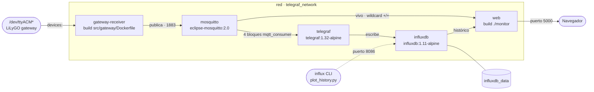

# Topología de contenedores

> Diagrama vivo. Editar el bloque Mermaid, no exportar a imagen.
>
> Refleja `docker-compose.yaml` tras la containerización del receiver
> (sesión 2026-07-24). Cinco servicios, una red, un volumen nombrado.

## El stack

`docker compose up -d` levanta todo. La cadena de datos va de izquierda a
derecha; lo que cuelga por fuera de la red son las puertas al host.

## Los cinco servicios

| Servicio | Imagen / build | Puertos al host | Monta | Depende de |
|---|---|---|---|---|
| `gateway-receiver` | `src/gateway/Dockerfile` | — | `mesh_config.json` (ro), device USB | mosquitto |
| `mosquitto` | `eclipse-mosquitto:2.0` | `1883`, `9002→9001` | `./mqtt` (conf), `./data`, `./log` | — |
| `telegraf` | `telegraf:1.32-alpine` | — | `telegraf.conf` (ro) | influxdb, mosquitto |
| `influxdb` | `influxdb:1.11-alpine` | `8086` | volumen `influxdb_data` | — |
| `web` | `./monitor` | `5000` | — | influxdb, mosquitto |

`configuration.env` (gitignored) inyecta credenciales en `telegraf`, `influxdb`
y `web`. Los nombres de contenedor no coinciden con los de servicio salvo en
`telegraf` e `influxdb`: el broker es `meshtastic-testbed-mqtt-broker`, el
receiver `meshtastic-testbed-gateway`, el dashboard `meshtastic-testbed-web`.
Para `docker exec` va el nombre de contenedor; para `docker compose`, el de
servicio.

## Cinco cosas que el diagrama deja ver

**1. `web` tiene dos caminos de datos, no uno.**
Consulta InfluxDB para el histórico y **además** se suscribe directo a Mosquitto
con `SUBSCRIBE_TOPIC=meshtastic-testbed/+/+` para el tiempo real vía SocketIO.
El wildcard captura los cinco tópicos — o sea que durante los seis días en que
`message` y `pdr` no llegaban a InfluxDB, el dashboard **sí** los recibía en
vivo. Es la razón por la que el defecto de ingesta no se notó mirando la pantalla.

**2. El broker es anónimo.**
`mqtt/mosquitto.conf` tiene `allow_anonymous true` y el `password_file`
comentado. Aceptable mientras todo corre en una máquina aislada. Deja de serlo
en cuanto la RPi del nodo proxy publique desde otra ubicación — que es el plan
en [`data-flow-measurement-points.md`](./data-flow-measurement-points.md). Ese
es el momento de habilitar el `pwfile` (ya está previsto en `.gitignore`).

**3. El passthrough del USB depende de un path que se mueve.**
`GATEWAY_SERIAL_PORT` (default `/dev/ttyACM0`) se usa igual dentro y fuera del
contenedor. Los `ttyACM*` se reordenan entre reboots — ya pasó en la sesión del
07-13, con el gateway en `ttyACM1` y dos SensCAP en `ttyACM0`/`ttyACM3`. Con el
número equivocado el contenedor arranca y no escucha nada. Conviene apuntarlo a
`/dev/serial/by-id/...`, que es estable.

**4. `telegraf` declara `extra_hosts: host.docker.internal` y no lo usa.**
`telegraf.conf` alcanza al broker por nombre de servicio (`mosquitto:1883`).
Ese `extra_hosts` es de cuando el receiver corría en el host y publicaba desde
afuera; hoy parece vestigial. No molesta, pero conviene confirmarlo y sacarlo.

**5. La persistencia está partida en dos.**
InfluxDB usa un volumen nombrado (`influxdb_data`, gestionado por Docker),
mientras que Mosquitto persiste en bind mounts dentro del árbol del repo
(`./data`, `./log`, ambos gitignored). O sea que `docker compose down -v` borra
la base pero no la cola del broker, y un `rm -rf data/` hace lo inverso.

## Nota sobre `depends_on`

Sólo ordena el arranque, no espera a que el servicio esté listo. Telegraf e
InfluxDB reintentan solos, así que hoy no hay problema — pero cualquier servicio
nuevo que asuma que su dependencia ya responde va a fallar de forma
intermitente, y sólo en arranques en frío.
