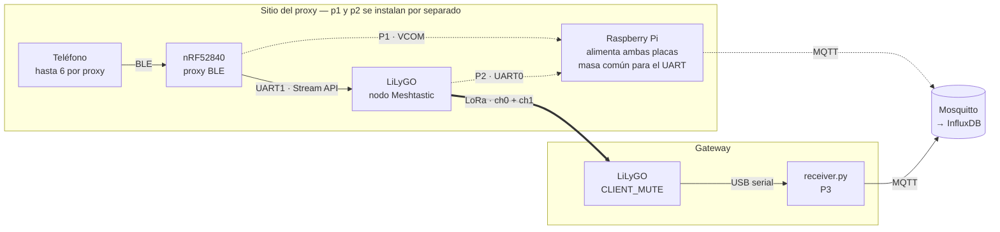

# Flujo de datos y puntos de medición

> Diagrama vivo. Editar el bloque Mermaid, no exportar a imagen — se renderiza
> en GitHub y debe cambiar junto con el código.
>
> **Estado:** la Raspberry Pi y los puntos P1/P2 son un plan, no están
> instalados. Hoy sólo existe P3. La decisión y sus condiciones previas están en
> [`ADR-0002`](../architecture/ADR-0002-proxy-site-edge-collector.md).

## Por qué hacen falta tres puntos

Un paquete de mensajería atraviesa tres medios distintos antes de llegar a la
base, y cada uno puede perderlo por razones que no tienen nada que ver entre sí:
congestión BLE, contrapresión del Stream API por UART, o colisión en el aire.

Hoy sólo se observa el final de la cadena, así que las tres pérdidas están
colapsadas en un solo número. Un PDR bajo no dice si el problema es el enlace
de radio o un teléfono que se desconectó.

## La cadena



Las flechas punteadas son instrumentación: no transportan el mensaje, lo
observan.

## Qué mide cada punto

| Punto | Dónde | Qué registra | Estado |
|---|---|---|---|
| **P1** | VCOM del nRF52840 | Lo que el proxy **intentó** entregar al nodo | Contadores sí; ids rotos — ver abajo |
| **P2** | Consola USB del LiLyGO, leída en texto plano | Lo que el nodo **puso en el aire**, con su `pkt_id` | ✅ Verificado, no instalado |
| **P3** | `receiver.py` en el gateway | Lo que **llegó** por la malla | ✅ Operativo |

**P2 es un lector pasivo, no un cliente.** El firmware sólo admite una instancia
del Stream API y el proxy ya la ocupa por UART1, así que la idea original de
conectar un cliente Meshtastic por USB es imposible. Pero la consola USB emite el
ciclo de vida completo en texto mientras nadie hable protobuf por ahí:

```
[Serial]  PACKET FROM PHONE  (id=0x19f326ba ... Portnum=256)
[Serial]  enqueue for send   (id=0x19f326ba ... encrypted len=36)
[RadioIf] Started Tx         (id=0x19f326ba ...)
[RadioIf] Packet TX: 260ms
[RadioIf] Completed sending  (id=0x19f326ba ...)
```

Ese `id` es el mismo `pkt_id` que el gateway ya guarda. Y como son tres etapas,
"el proxy lo entregó pero el nodo no transmitió" queda distinguible de
"transmitió y no llegó" — más fino que lo que se había diseñado.

La consola además emite `txGood=…,txRelay=…,rxGood=…,rxBad=…`: totales
monotónicos, así que una línea de log perdida no corrompe la cuenta.

Y la atribución que habilitan:

| Diferencia | Pérdida atribuible |
|---|---|
| P1 − P2 | BLE (teléfono→proxy) + Stream API por UART (proxy→nodo) |
| P2 − P3 | Radio: colisión, alcance, congestión de airtime |
| Sólo P3 | Las tres juntas, indistinguibles — la situación actual |

## El `pkt_id` es la llave

P2 y P3 se cruzan por el `pkt_id` que asigna el firmware del nodo: el PDR de
mensajería es la fracción de `pkt_id` transmitidos que aparecen en recepción.
No hace falta el contador `seq` propuesto en el repo del proxy.

**Pero hay que contar ids únicos, no eventos.** Los mensajes de teléfono salen
con `WantAck=1`, así que el nodo retransmite hasta recibir ACK: el mismo `id`
aparece varias veces en `Completed sending`. Eso habilita dos ratios distintos
—entrega al primer intento (calidad del enlace) y entrega final tras reintentos
(calidad del servicio)— y es la segunda razón, además del estimador, por la que
el PDR de mensajería y el de telemetría no son comparables entre sí.

Dos advertencias más sobre ese cruce:

- **InfluxQL no puede hacerlo.** `pkt_id` es un *field* (tiene que serlo: es
  único por paquete y como tag haría crecer la cardinalidad sin techo), y los
  fields no están indexados. El join va en un proceso suscriptor a ambos
  streams; la base sólo guarda el resultado, igual que ya hace con el PDR de
  telemetría.
- **Necesita ventana de gracia.** P2 y P3 llegan por caminos distintos y desde
  relojes distintos. Hay que esperar N segundos antes de dar un `pkt_id` por
  perdido — misma forma que el `sweep()` de `CadencePdrTracker`.

## Qué le falta a P1

`proxy_id_to_str()` en `../meshtastic-ble-proxy/src/proxy_protocol.c` lee 16
bytes de un arreglo de 4, y lo alcanza `proxy_header_to_str()` — la función que
arma las líneas legibles del firmware. Los `src`/`dst` que imprime son lectura
fuera de rango, no los ids reales.

Eso **no** invalida P1: los contadores de drop, el censo de conexiones BLE, los
overruns de UART y los reboots del nodo siguen siendo correctos, y son la mayor
parte de su valor. Tampoco bloquea el PDR agregado de mensajería, que se apoya
en el `pkt_id` de P2.

Lo único que bloquea es el **desglose por teléfono**: la consola del nodo lleva
el id de paquete y nunca el `src_id` de la aplicación, así que atribuir una
pérdida a un handset concreto exige que el log del proxy sea confiable. Detalle
en [`proxy-frame-wire-format`](../../.claude/memory/proxy-frame-wire-format.md).

## Dos trampas al leer estas consolas

**`Ch=` significa dos cosas.** En líneas de aire (`Lora RX`, `Started Tx`) es el
**hash** del canal (`Ch=0xec`); en líneas decodificadas es el **índice**
(`Ch=0x0`). El propio log lo mapea: `[Router] Use channel 0 (hash 0xec)`.

**Abrir el puerto puede reiniciar el nodo.** El circuito de auto-reset por
DTR/RTS dispara cuando un host abre el USB de una placa ESP32. Un lector que
reconecte tras un hipo rebootearía el nodo, y cada reboot dispara el
`reanchor()` del estimador: el instrumento ensuciando la medición.

## Por qué la Pi, si no es por la energía

Un hub USB con fuente propia resuelve el problema de los dos puertos por una
fracción del costo. La Pi se justifica por otras dos razones:

1. **P1 y P2 no existen sin ella.** Es lo que convierte el PDR de mensajería de
   inferencia en resta.
2. **Masa común.** El nordic y el LiLyGO están unidos por UART, así que
   comparten masa obligatoriamente. Dos fuentes separadas dejan las masas
   flotando entre sí, y eso aparece como bytes corruptos o el enlace muerto de a
   ratos — un síntoma que se persigue durante días creyendo que es el firmware.

Restricciones prácticas: la fuente de la Pi tiene que ser la adecuada (Pi 4 →
3 A; Pi 5 → 27 W) o limita la corriente de los puertos USB y aparecen
desconexiones aleatorias de `ttyACM*`; usar `/dev/serial/by-id/` y nunca
`ttyACM0`, que se intercambia entre reboots; y no acumular logs en la SD.
