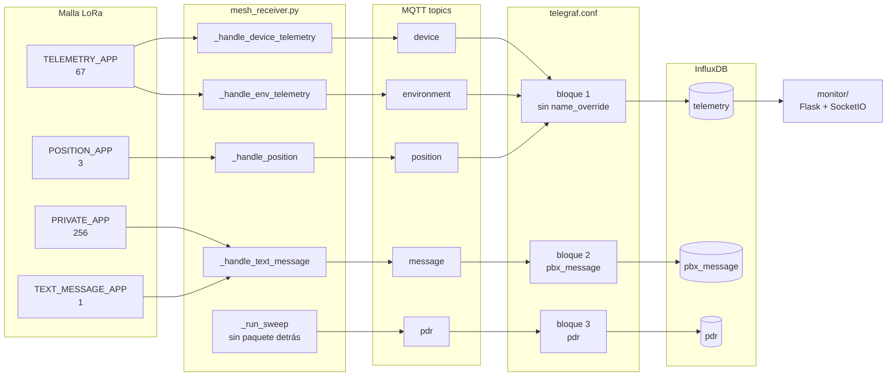
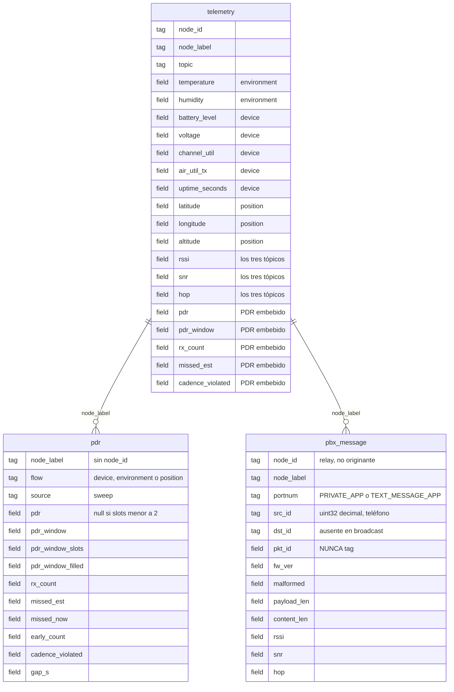

# Ingesta y esquema de la base

> Diagrama vivo. Editar el bloque Mermaid, no exportar a imagen.
>
> Refleja el estado posterior al 2026-08-06, cuando se reparó la ingesta de los
> tópicos `message` y `pdr` (publicados desde el 07-31, consumidos por nadie).

## Cómo llegan los datos

Desde el paquete en el aire hasta la fila en InfluxDB. El `portnum` decide qué
handler lo procesa, el handler decide a qué tópico va, y el bloque de Telegraf
decide en qué measurement aterriza.

Dos cosas que el diagrama hace explícitas:

- **`_run_sweep` no tiene paquete de entrada.** Es el detector de silencio: sin
  él un nodo muerto congela su último PDR para siempre. Es la única rama que
  nace del reloj y no de la malla.
- **`monitor/` sólo lee `telemetry`.** Las otras dos measurements todavía no
  tienen consumidor en el dashboard.

## El esquema

Las relaciones son por `node_label` — no hay claves foráneas en InfluxDB, pero
es el único tag que las tres comparten y por el que tiene sentido cruzarlas.

## Las cuatro reglas que sostienen el diseño

**1. `pbx_message` no puede vivir en `telemetry`.**
Trae `rssi`/`snr`/`hop` para el mismo `node_id` que la telemetría, pero a
cadencia dirigida por teléfonos. `monitor/utils.py get_recent()` filtra esos
gráficos sólo por `node_id`, sin mirar el tópico: compartir measurement
mezclaría dos poblaciones con muestreos distintos en el mismo chart, sin error
visible. Es contaminación, no una caída.

**2. `pkt_id` es field, nunca tag.**
Es único por paquete. Como tag, la cardinalidad de series crecería sin techo
hasta voltear la base. Como field no está indexado — de ahí que el join TX↔RX
tenga que ocurrir aguas arriba.

**3. Los valores de tag son la identidad de la serie.**
`src_id` y `dst_id` se publican como `uint32` decimal (el número telefónico que
loguea el PBX como `+56<uint32>`). Cambiar ese render más adelante no
actualiza nada: parte la historia en dos conjuntos de series disjuntos que ya no
se pueden unir. Por eso el formato del frame se verificó contra
`client-integration.md` **antes** de dejar escribir.

**4. Ausencias que son correctas, no bugs.**
`pdr` viene `null` mientras haya menos de 2 slots; `dst_id` no existe en los
frames broadcast; el grupo entero de PDR está ausente cuando el nodo no declara
cadencia para ese flujo en `mesh_config.json`. Telegraf saltea los `null`, así
que se traducen en campos ausentes y el frontend ya los ignora.

## Lo que todavía no está

La measurement que falta es la del lado TX (`P1`/`P2` en
[`data-flow-measurement-points.md`](./data-flow-measurement-points.md)). Sin
ella, `pbx_message` registra recepciones sin denominador y no hay PDR de
mensajería, sólo conteo.

Tampoco hay test de ingesta: los 94 tests cubren el publisher, no
`telegraf.conf`. Ese hueco es exactamente el que dejó `message` y `pdr` sin
consumir durante seis días sin que nada fallara.
